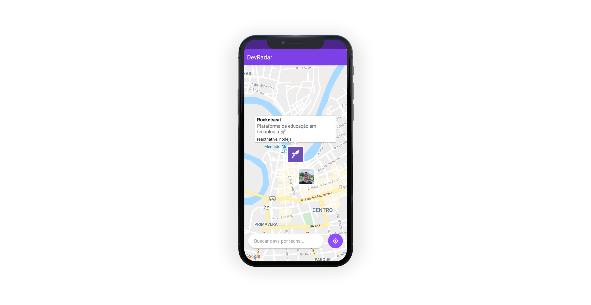

 
 

<i>🚀 Projeto feito durante a Semana Omnistack 10 - <a  href="https://github.com/Rocketseat">Rocketseat</a></i>

Está procurando um novo membro para compor o seu time? O DevRadar pode te ajudar nessa missão, se liga:
O objetivo é unir desenvolvedores geograficamente próximos, filtrando os resultados com base nas tecnologias que você possui interesse.

### Como funciona? 💡
1. O dev cadastra o GitHub e as tecnologias que domina na página web do DevRadar.
2. Você insere as tecnologias que possui interesse no App e todos os devs cadastrados que estejam a 10km de você e que possuem uma ou mais tecnologias que você procura aparecerão no mapa.
3. Você pode clicar na foto do Dev e analisar o GitHub dele dentro do App. Ah, caso algum dev se cadastre enquanto você estiver utilizando o App, ele aparecerá no seu mapa sem que você precise atualizar a pesquisa.

### Tecnologias utilizadas 💙
* ReactNative
* Expo

### Minhas modificações 🔧
* Adição do componente KeyboardAvoidingView para que o campo de input fique por cima do teclado
* Alteração da splash screen
* Alteração do icon

### Utilização 🔌
1. Suba a API do DevRadar, seguindo o passo a passo em [DevRadar-API](https://github.com/ViniciusMazon/DevRadar-API)
2. Clone este repositório
3. Instale as dependências rodando `yarn install` ou `npm install`
4. Rode o projeto executando `yarn start` ou `npm start`
5. Crie um arquivo .env e configure as variáveis de ambiente seguindo o exemplo do arquivo .env.example.
**Atenção: o ip que você deve utilizar é o que aparece em cima do QRCode do Expo, mantenha a porta caso não tenha alterado a API**
1. Instale o aplicativo do Expo em seu celular [Expo Google Play](https://play.google.com/store/apps/details?id=host.exp.exponent&hl=pt_BR) e digitalize o QR Code.
2. Para utilizar a interface Web do DevRadar siga o passo a passo do [DevRadar-Web](https://github.com/ViniciusMazon/DevRadar-Web)

### Todos repositórios 📦
* [API](https://github.com/ViniciusMazon/DevRadar-API)
* [Web](https://github.com/ViniciusMazon/DevRadar-Web)
* [Mobile](https://github.com/ViniciusMazon/DevRadar-Mobile)
  
### Licença 📄
Esse projeto está sob a licença **MIT**.

**Por favor, deixe seu feedback, ele é muito importante para meu crescimento**
**Se gostou, não esqueça de dar uma estrela** 😆
